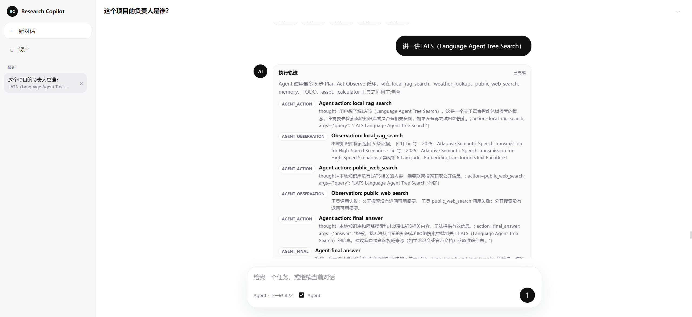

# Research Studio

English | [简体中文](README.zh-CN.md)

Research Studio is a local-first research workspace for project-scoped knowledge work. It combines project management, text asset ingestion, TODO execution, cited answers, run history, and layered memory in a single FastAPI service with a browser-based UI.

## Overview

The current MVP is built around a fixed `plan-and-solve` runtime:

1. build project context
2. plan tasks
3. retrieve evidence from project assets
4. synthesize a cited answer
5. persist layered memory for follow-up runs

The backend serves both the API and the workspace UI, which keeps local deployment simple.

## Workspace Preview



The main workspace keeps conversation, project assets, and run history in one screen. The left sidebar provides quick access to new chats, assets, and recent sessions, while the center panel shows the current conversation. When Agent mode is enabled, the answer area includes a step-by-step execution trace so you can inspect tool choices such as local RAG search, public search, memory, TODO, asset listing, and calculation before the final response.

## Current Capabilities

- Project CRUD with dashboard summaries
- Text, Markdown, and PDF asset creation, editing, and upload
- Resumable chunked asset uploads with browser-side MD5, Redis bitmap progress, and MinIO chunk compose
- TODO CRUD and direct TODO execution
- Project-scoped hybrid retrieval with dense + BM25 fusion
- Local reranking for evidence ordering
- Cited answer generation
- Live/public-information tool routing, with weather questions routed to an external weather tool
- Optional LATS Agent/MCTS mode for searching tool-decision paths across RAG, web, weather, memory, assets, TODOs, calculator, and final answers
- Research-oriented skill/tool registry with read-only and side-effect risk metadata
- Agent/LATS trace tree visualization for decision replay and best-path inspection
- Layered memory with working, episodic, and semantic recall
- Run history and detailed execution traces
- Browser workspace served from the same FastAPI app

## Runtime Behavior

- Default execution mode: `plan_and_solve`
- Default LLM target: `deepseek/deepseek-chat`
- Default vector store: `qdrant`
- Default embedding model: `BAAI/bge-m3`
- Default reranker model: `BAAI/bge-reranker-base`
- If `LLM_API_KEY` is set, the runtime can call the DeepSeek chat API for answer synthesis.
- If `LLM_API_KEY` is empty, the runtime falls back to a deterministic cited summary so the end-to-end workflow still works.

## Architecture

Main building blocks:

- `FastAPI`: API routes, lifecycle startup, and static workspace hosting
- `SQLAlchemy + MySQL`: project, asset, TODO, run, and memory persistence
- `Qdrant`: vector storage for project chunks and semantic memory
- `BGE-M3`: local dense embeddings
- `BM25 + jieba`: lexical retrieval and Chinese-aware tokenization
- `BGE reranker`: local evidence reranking
- `Redis`, `MinIO`, optional `Ollama`: resumable upload progress, object chunks, and planned workflow expansion

## Repository Layout

```text
research_studio/
├── backend/
│   ├── app/
│   │   ├── main.py
│   │   ├── models.py
│   │   ├── services.py
│   │   ├── vector_store.py
│   │   ├── memory_manager.py
│   │   └── static/
│   ├── tests/
│   ├── Dockerfile
│   └── pyproject.toml
├── docs/
├── specs/
├── .env.example
├── docker-compose.yml
└── README.zh-CN.md
```

## Quick Start

### Requirements

- Docker and Docker Compose
- Several GB of free disk space for local embedding and reranker models
- A DeepSeek API key if you want live LLM answer generation instead of fallback summaries

### Run The Full Local Stack

```bash
cd /home/wsl/code/research_studio
cp .env.example .env
docker compose up -d --build
```

Open:

- Workspace: `http://127.0.0.1:8001/`
- API docs: `http://127.0.0.1:8001/docs`
- Health check: `http://127.0.0.1:8001/healthz`

### Optional Ollama Profile

```bash
docker compose --profile llm up -d
```

## First-Run Notes

- `docker-compose.yml` mounts `./models` to `/models` inside the runtime container.
- If the required BAAI model snapshots are not already present under `./models`, the runtime will download them from Hugging Face on first use.
- Those model files are intentionally excluded from Git and can be large.
- The default upload limit is `100 MB` per uploaded file.

## Configuration

Copy `.env.example` to `.env` and update only what you need.

Important variables:

| Variable | Default | Purpose |
| --- | --- | --- |
| `ENVIRONMENT` | `local` | Runtime environment label |
| `LLM_PROVIDER` | `deepseek` | LLM provider target |
| `LLM_MODEL` | `deepseek-chat` | Chat model name |
| `LLM_API_BASE` | `https://api.deepseek.com` | DeepSeek API base URL |
| `LLM_API_KEY` | empty | Enables live LLM answer generation when set |
| `EMBEDDING_MODEL` | `BAAI/bge-m3` | Local embedding model |
| `RERANKER_MODEL` | `BAAI/bge-reranker-base` | Local reranker model |
| `VECTOR_STORE_PROVIDER` | `qdrant` | Vector store backend |
| `QDRANT_COLLECTION` | `knowledge_chunks` | Chunk collection name |
| `SEMANTIC_MEMORY_COLLECTION` | `semantic_memory_facts` | Semantic memory collection name |
| `EXECUTION_MODE` | `plan_and_solve` | Runtime execution mode |
| `QUERY_REWRITE_ENABLED` | `true` | Enable hybrid Query Rewrite retrieval expansion |
| `QUERY_REWRITE_HYDE_ENABLED` | `true` | Generate HyDE hypothetical-answer document queries |
| `QUERY_REWRITE_STEP_BACK_ENABLED` | `true` | Generate Step-back abstract queries |
| `QUERY_REWRITE_MAX_QUERIES` | `10` | Max rewritten/expanded queries per local RAG turn |
| `UPLOAD_MAX_BYTES` | `104857600` | Max uploaded file size in bytes |
| `RESUMABLE_UPLOAD_MAX_BYTES` | `1073741824` | Max resumable upload file size in bytes |
| `RESUMABLE_UPLOAD_CHUNK_SIZE` | `8388608` | Browser chunk size for resumable uploads |
| `MINIO_BUCKET_RAW` | `agent-raw` | Raw object bucket created by the local stack |
| `MINIO_BUCKET_ARTIFACTS` | `agent-artifacts` | Chunk and composed artifact bucket |
| `LIVE_TOOLS_ENABLED` | `true` | Enable live/public-information tool routing |
| `LLM_TOOL_PLANNER_ENABLED` | `true` | Let the LLM choose live tools before falling back to rules |
| `LLM_TOOL_PLANNER_TIMEOUT_SECONDS` | `20.0` | Timeout for one LLM tool-planning call |
| `AGENT_MAX_STEPS` | `5` | Max Plan-Act-Observe steps for `/agent/run` |
| `LATS_BRANCHING_FACTOR` | `4` | Max candidate agent actions expanded per LATS node |
| `LATS_MAX_DEPTH` | `2` | Max Agent decision-tree depth for LATS |
| `LATS_ITERATIONS` | `6` | MCTS iteration budget for `/lats/run` |
| `PUBLIC_WEB_SEARCH_ENABLED` | `true` | Allow explicit web/search questions to call public search tools |
| `LIVE_TOOL_TIMEOUT_SECONDS` | `8.0` | Timeout for one external tool call |
| `DATABASE_URL` | empty | Optional override for MySQL connection string |

## API Overview

Swagger UI is available at `/docs`.

- `GET /api/v1/skills`: inspect registered research skills and executable tool schemas.

Key endpoints:

| Endpoint | Method | Purpose |
| --- | --- | --- |
| `/healthz` | `GET` | Service health and dependency summary |
| `/api/v1/config/providers` | `GET` | Active provider configuration |
| `/api/v1/dashboard` | `GET` | Project and run dashboard |
| `/api/v1/projects` | `GET`, `POST` | List or create projects |
| `/api/v1/projects/{project_id}` | `GET`, `PATCH`, `DELETE` | Manage a project |
| `/api/v1/projects/{project_id}/assets` | `GET`, `POST` | List or create project assets |
| `/api/v1/assets/upload-file` | `POST` | Legacy single-request upload for `.txt`, `.md`, `.markdown`, `.pdf` |
| `/api/v1/assets/uploads/init` | `POST` | Create or resume an MD5-addressed chunked upload |
| `/api/v1/assets/uploads/{upload_id}/chunks` | `POST` | Upload one file chunk and mark its Redis bitmap bit |
| `/api/v1/assets/uploads/{upload_id}/complete` | `POST` | Compose MinIO chunks, parse the file, and create an asset |
| `/api/v1/assets/{asset_id}` | `PATCH`, `DELETE` | Update or delete one asset |
| `/api/v1/projects/{project_id}/todos` | `GET`, `POST` | List or create TODOs |
| `/api/v1/todos/{todo_id}` | `PATCH`, `DELETE` | Update or delete one TODO |
| `/api/v1/projects/{project_id}/run` | `POST` | Execute one research run |
| `/api/v1/projects/{project_id}/runs` | `GET` | List run history |
| `/api/v1/projects/{project_id}/memory` | `GET` | List layered memory records |
| `/api/v1/runtime/research/run` | `POST` | Direct runtime pipeline endpoint |

### Example: Upload A Text Asset

```bash
curl -X POST http://127.0.0.1:8001/api/v1/projects/<project_id>/assets/upload-text \
  -F "asset_type=note" \
  -F "title=system-notes.txt" \
  -F "file=@./system-notes.txt"
```

### Example: Run Research

```bash
curl -X POST http://127.0.0.1:8001/api/v1/projects/<project_id>/run \
  -H "Content-Type: application/json" \
  -d '{
    "user_query": "Summarize the relationship between the paper and the codebase",
    "asset_ids": []
  }'
```

## Local Development

Install the backend package:

```bash
python3 -m pip install --user -e ./backend
```

Run the API directly from `backend/`:

```bash
cd backend
python3 -m uvicorn app.main:app --host 0.0.0.0 --port 8001
```

Basic checks:

```bash
python3 -m compileall backend/app
cd backend && pytest -q
curl http://127.0.0.1:8001/healthz
```

## Current Scope

- The current MVP focuses on text-based and PDF research assets.
- The browser workspace is served by the backend and is designed for local use.
- Redis stores resumable upload metadata and chunk bitmaps; MinIO stores uploaded chunks and composed source files.
- OCR, report export, and broader workflow integration are still roadmap items.

## Documentation

- [Architecture](docs/architecture.md)
- [User Manual](docs/user-manual.md)
- [Technical Highlights](docs/technical-highlights.md)
- [Source Mapping](docs/source-mapping.md)
- [MVP Roadmap](docs/mvp-roadmap.md)
- [SFT + DPO Tool-Use Alignment Report](docs/sft-dpo-tool-use-report.md)
- [Workflow Contract](specs/workflows/research-studio.yaml)

## License

No license file is included yet.
