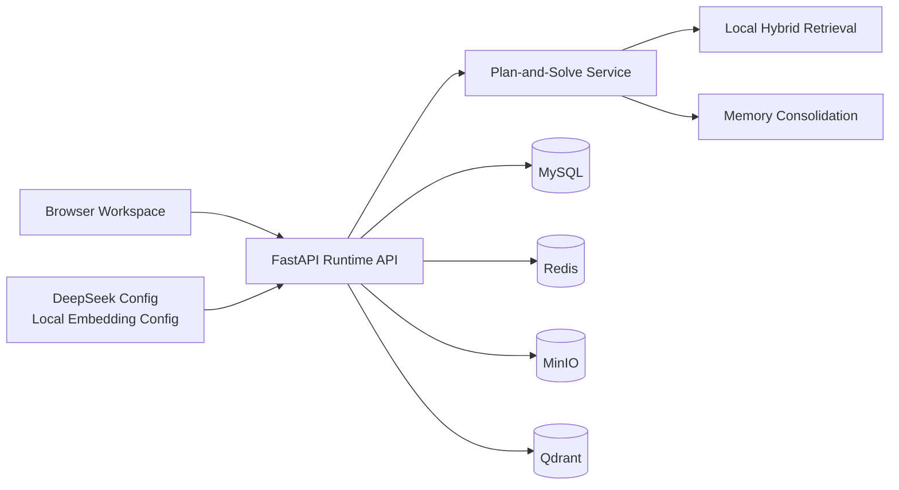
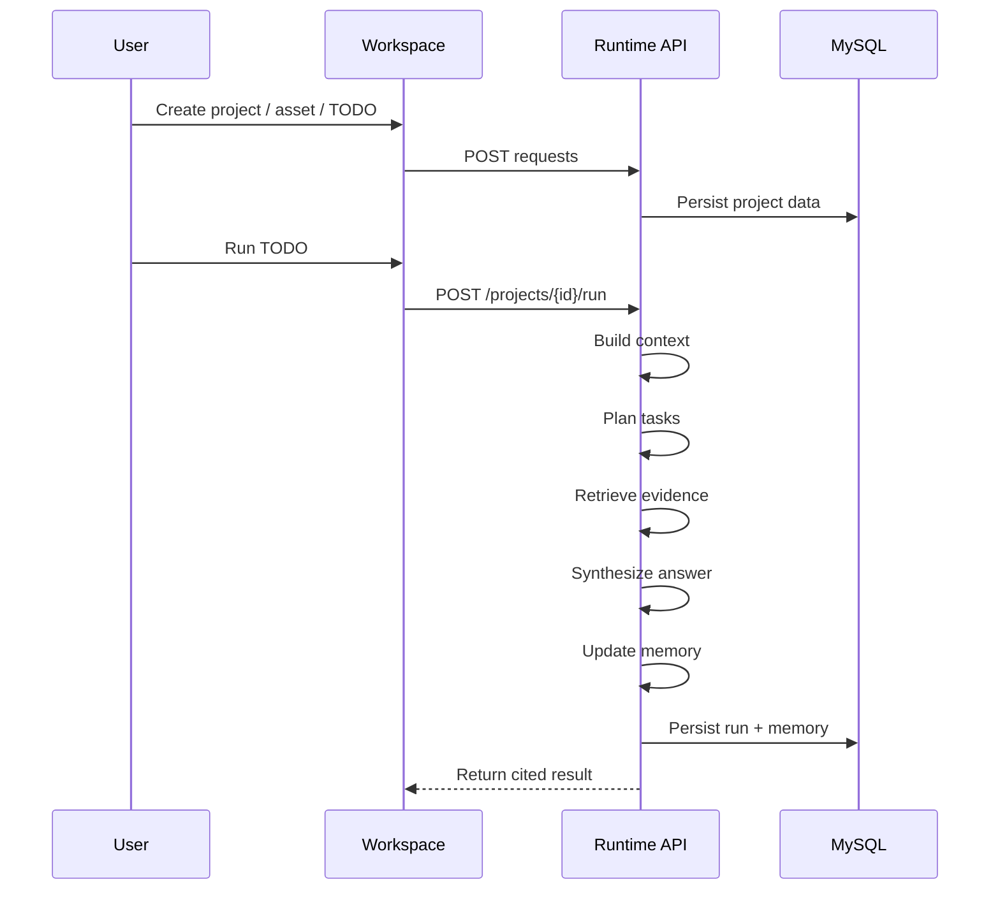

# System Architecture

## Overview

The current system uses a single FastAPI service to host both the frontend
workspace and the backend runtime. The runtime follows a `plan-and-solve`
pipeline and persists project state in MySQL.

## Backend Layers

- `main.py`: HTTP routes, lifespan startup, static frontend mount
- `services.py`: project CRUD, TODO workflow, run orchestration, retrieval, memory
- `db_models.py`: SQLAlchemy persistence model
- `models.py`: request and response schemas
- `static/`: browser workspace UI

## Runtime Flow

## Notes

- DeepSeek and local embedding providers are configuration targets, not yet active inference backends.
- Retrieval currently uses open-source local components and project asset text.
- The current frontend is backend-served to keep the deployment simple and reliable.
